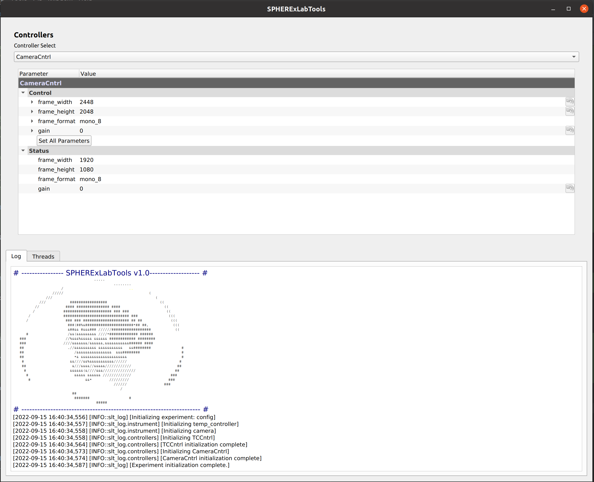
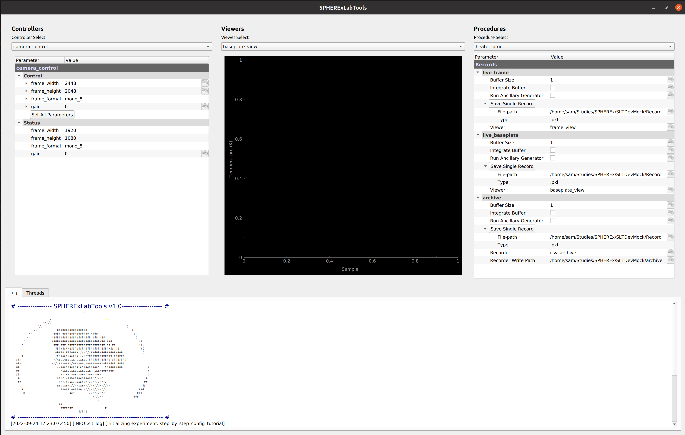

Step-by-Step Experiment Configuration
######################################

| This section utilizes the pymeasure SwissArmyFake class to work through each step of configuring SPHERExLabTools for
  a given experiment. The SwissArmyFake class generates mock data as if it were a real instrument, but does not require
  a connection to any real hardware.

| The dummy experiment is the monitoring of a "cryostat baseplate temperature" in response to some "voltage applied to a heater".
  Additionally, the thermal emission of the "heater" is monitored via an "IR camera". This tutorial walks through the steps required
  to configure the instruments in this experiment, write measurement scripts, view live temperature and camera data, and write
  data to output files for later analysis.

0) Setting up the configuration file structure
-----------------------------------------------

| As discussed in :ref:`Fundamentals <user_guide/fundamentals:Fundamentals>`, SPHERExLabTools reads user defined :ref:`Experiment Control Packages <user_guide/fundamentals:Experiment Control Packages>`
  to configure control software for a given experiment. Experiment control packages define the 5 configuration variables:

    - INSTRUMENT_SUITE: python list of hardware configuration dictionaries.
    - CONTROLLERS: list of controller configuration dictionaries.
    - PROCEDURES: list of procedure configuration dictionaries.
    - VIEWERS: list of viewer configuration dictionaries.
    - RECORDERS: list of recorder configuration dictionaries.

| The file structure of the experiment control package can be in whatever manner the user desires, though the standard structure is as follows:

    config/
     - instruments/
     - procedures/
     -  __init__.py
     -  control.py
     -  hw.py
     -  measure.py

| Where the configuration dictionaries are defined for instruments in hw.py, for controllers in control.py, and viewers, recorders, and procedures
  in measure.py. The __init__.py file then defines the config variables as lists of the dictionaries defined in the other .py files. The instruments/
  and procedures/ directories are used for custom user procedure scripts and instrument drivers.

| Begin by cloning this configuration file structure with the following git command:

.. code-block:: bash

    git clone https://github.com/samcondon4/PyLabTools-Template.git

| Let's first take a look at the __init__.py file. From the cloned repository, the contents of the file are as follows:

.. code-block:: python

    from . import hw
    from . import control
    from . import measure
    from . import instruments
    from . import procedures

    # - Populate these lists with configuration dictionaries defined in the imported files! - #
    VIEWERS = []
    RECORDERS = []
    PROCEDURES = []
    CONTROLLERS = []
    INSTRUMENT_SUITE = []

| Note the definition of all 5 of the aforementioned configuration variables. To configure SPHERExLabTools, we populate these variables
  with configuration dictionaries corresponding to each component of the control software. In the following steps, do not worry too much about the
  contents of the configuration dictionaries that we define. The purpose of this tutorial is to get a big picture sense of how SPHERExLabTools
  is configured, not to understand all of the details of configuration dictionary syntax. These syntax details can be found at:
  :ref:`Configuration Dictionaries <user_guide/configuration:Configuration Dictionaries>`

1) Defining instruments
------------------------

| First, let's populate the hw.py file with the "instruments" in use. For this experiment, we are making use of a "temperature controller"
  with a single heater output and temperature input channel. We also are using an "IR camera".

| Add the following block to your hw.py file, which will configure each of these pieces of hardware:

.. code-block:: python

    TempController = {
        "instance_name": "temp_controller",
        "manufacturer": "custom_fakes",
        "instrument": "TemperatureController",
        "resource_name": 0.1,
    }

    Camera = {
        "instance_name": "camera",
        "manufacturer": "custom_fakes",
        "instrument": "Camera",
        "resource_name": 0.3
    }

| We have now defined a few hardware configuration dictionaries, but SPHERExLabTools will not be able to see that these exist if we do not add them to the
  **INSTRUMENT_SUITE** list. Back in the __init__.py file, add each dictionary to the **INSTRUMENT_SUITE** variable:

.. code-block:: python

    INSTRUMENT_SUITE = [hw.TempController, hw.Camera]

2) First instrument controller
-------------------------------

| Now, we can add a few controller configuration dictionaries to allow us to control the parameters of our newly added instruments with the SPHERExLabTools
  graphical interface!

| Add the following block to control.py:

.. code-block:: python

    TCCntrl = {
        "instance_name": "tc_control",
        "type": "InstrumentController",
        "hw": "temp_controller",
        "control_parameters": [
            {"name": "heater_output", "type": "float", "value": 0.0}
        ],
        "status_parameters": [
            {"name": "plate_temperature", "type": "float", "value": 40}
        ],
        "status_refresh": 1000
    }

    CamCntrl = {
        "instance_name": "camera_control",
        "type": "InstrumentController",
        "hw": "camera",
        "control_parameters": [
            {"name": "frame_width", "type": "int", "value": 2448},
            {"name": "frame_height", "type": "int", "value": 2048},
            {"name": "frame_format", "type": "list", "limits": ["mono_8", "mono_16"]},
            {"name": "gain", "type": "float", "value": 0.0}
        ],
        "status_parameters": [
            {"name": "frame_width", "type": "str"},
            {"name": "frame_height", "type": "str"},
            {"name": "frame_format", "type": "list", "limits": ["mono_8", "mono_16"]},
            {"name": "gain", "type": "float", "value": 0.0}
        ],
        "status_refresh": "after_set"
    }

| And update the **CONTROLLERS** list with:

.. code-block:: python

    CONTROLLERS = [control.TCCntrl, control.CamCntrl]

| We can now start the SPHERExLabTools graphical interface. Start a python interactive session and run:

.. code-block:: python

    >>> import spherexlabtools as slt
    >>> import config
    >>> exp = slt.create_experiment(config)
    >>> exp.start()

| The following interface should now appear:

    SPHERExLabTools interface with first instrument controllers.

| With this interface we can now set basic parameters of our instruments manually. The "Control" drop-down provides a carot drop-down
  for each parameter allowing parameters to be set individually, or all parameters can be set at once with the "Set All Parameters" button.
  The "Status" drop-down displays the current value of each parameter. The "Controller Select" selection allows one to switch between controllers.
  Switching to the "TCCntrl" controller reveals a simple interface for the temperature controller with the baseplate temperature being read and updated
  in the interface every second.

3) Creating a procedure
------------------------

| As discussed in :ref:`Fundamentals <user_guide/fundamentals/index:Fundamentals>`, **Procedures** are classes used to define scripts that run measurements.
  Let's write a procedure to run our basic measurement. In the **procedures** directory create an empty python file called *heater_measurements.py*. Now, copy
  the following code into the file:

.. code-block:: python

    """ heater_measurements:

        Module implementing the procedure for the fake experiment in the step-by-step configuration tutorial
    """

    import time
    import logging
    import datetime
    import numpy as np
    import pandas as pd
    from spherexlabtools.procedures import Procedure
    from spherexlabtools.parameters import FloatParameter

    class HeaterProc(Procedure):

        heater_voltage = FloatParameter("Heater Voltage", default=0, units="V", minimum=0, maximum=10)
        sample_time = FloatParameter("Sample Time", default=10, units="s")
        sample_rate = FloatParameter("Sample Rate", default=1, units="hz")

        def __init__(self, cfg, exp, **kwargs):
            super().__init__(cfg, exp, **kwargs)
            self.cam = exp.hw.camera
            self.temp_control = exp.hw.temp_controller
            self.baseplate_temp_arr = None
            self.heater_voltage_arr = None
            self.heater_ir_emission_arr = None
            self.timestamps_arr = None
            self.meta_dict = None

        def startup(self):
            """ Set the heater voltage.
            """
            super().startup()
            self.temp_control.heater_voltage_arr = self.heater_voltage_arr
            # - set up the vectors for measured quantities - #
            samples = int(self.sample_time * self.sample_rate)
            self.baseplate_temp_arr = np.zeros(samples)
            self.heater_voltage_arr = np.zeros_like(self.baseplate_temp_arr)
            self.heater_ir_emission_arr = np.zeros_like(self.baseplate_temp_arr)
            self.timestamps_arr = np.zeros_like(self.heater_ir_emission_arr)
            self.meta_dict = {
                "camera_gain": [self.cam.gain],
                "camera_frame_width": [self.cam.frame_width],
                "camera_frame_height": [self.cam.frame_height],
            }

        def execute(self):
            for i in range(len(self.baseplate_temp_arr)):
                ts = datetime.datetime.now().strftime("%Y%m%d_%H%M%S.%f")
                frame = self.cam.frame
                baseplate = self.temp_control.plate_temperature

                # - emit live data for real-time feedback - #
                self.emit("live_frame", frame)
                self.emit("live_baseplate", baseplate)

                # - write to lists for archival - #
                self.heater_voltage_arr[i] = self.heater_voltage
                self.baseplate_temp_arr[i] = baseplate
                self.heater_ir_emission_arr[i] = self.get_heater_ir(frame)
                self.timestamps_arr[i] = ts

                time.sleep(1 / self.sample_rate)

            data_dict = {
                "baseplate_temp": self.baseplate_temp_arr,
                "heater_ir_emission": self.heater_ir_emission_arr,
                "heater_voltage": self.heater_voltage_arr,
                "timestamp": self.timestamps_arr
            }
            self.emit("archive", pd.DataFrame(data_dict), meta=pd.DataFrame(self.meta_dict))

        @staticmethod
        def get_heater_ir(frame):
            """ Calculate heater IR emission from an image.

            :param frame:
            :return:
            """
            return frame.mean()

| Note the basic structure of the file. We define the class *HeaterProc* which inherits from the base *Procedure* object.
  The parameters of the measurement (heater_voltage, sample_time, sample_rate) are defined as *class attributes* using various
  *Parameter* objects. In the class initialization method (__init__) we create some of the basic variables for instruments
  and the arrays where we store the measured data. When a procedure executes, the following three methods are run in order:

    1. **startup()**
    2. **execute()**
    3. **shutdown()**

| In **startup()** we create empty numpy arrays with the appropriate length based on the **sample_time** and **sample_rate** parameters.
  We also create the dictionary **meta_dict** which gathers the data that we classify as metadata for the experiment. **execute** is where
  the main action of the measurement runs. Here, we loop through the desired number of samples, and obtain a timestamp, the cryostat baseplate temperature,
  and an image from the "IR camera." Note that there is no **shutdown()** method defined in this procedure, though typically this method would be used
  to place all of the instruments in the experiment into an idle state.

| Also note the three calls of **self.emit()**. This is the method that sends measured data out to :ref:`Procedure <user_guide/fundamentals/index:Procedures>`
  and :ref:`Recorder <user_guide/fundamentals/index:Recorders>` classes for live display and archival.

4) Writing the procedure, viewer, and recorder configuration dictionaries
--------------------------------------------------------------------------

| We have now defined the procedure class which will run our measurement, but in order for SPHERExLabTools to be able to see the class we must define a
  procedure configuration dictionary and place it in the **PROCEDURES** configuration variable. First, add the following line to the __init__.py file found
  **in the procedures directory**:

.. code-block:: python

    from .heater_measurements import HeaterProc

| By adding this line we are adding the **HeaterProc** procedure class to the namespace of the **procedures** package which we import in our main __init__.py file.
  Now, in measure.py, copy the following code:

.. code-block:: python

    HeaterMeasureProc = {
        "instance_name": "heater_proc",
        "type": "HeaterProc",
        "hw": ["camera", "temperature_controller"],
        "records": {
            "live_frame": {"viewer": "frame_view"},
            "live_baseplate": {"viewer": "baseplate_view"},
            "archive": {"recorder": "csv_archive"}
        }
    }

| The "hw" key contains a list specifying use of 'camera' and 'temperature_controller', which matches the "instance_name" keys of the hardware configuration dictionaries
  that we specified earlier. Additionally, we note that the 'records' key contains an additional dictionary with keys 'live_frame', 'live_baseplate', and 'archive' which
  match the strings used as the first arguments of our calls to **self.emit()** in the procedure code. Finally, each of the record keys contain yet another dictionary where
  the viewer and/or recorder for the record is specified.

| The viewers and recorders specified for each record are referencing viewers and recorders that do not yet exist. We can create these with the following dictionaries, added
  again to the *measure.py* file:

.. code-block:: python

    FrameView = {
        "instance_name": "frame_view",
        "type": "ImageViewer",
    }

    BpView = {
        "instance_name": "baseplate_view",
        "type": "LineViewer",
        "params": {
            "left": "Temperature (K)",
            "bottom": "Sample"
        }
    }

    CsvArchive = {
        "instance_name": "csv_archive",
        "type": "CsvRecorder",
    }

| Now, we add all of the configuration dictionaries that we just defined to our main __init__.py file. The contents of this file should now look like:

.. code-block:: python

    from . import hw
    from . import control
    from . import measure
    from . import procedures
    from . import instruments

    VIEWERS = [measure.FrameView, measure.BpView]
    RECORDERS = [measure.CsvArchive]
    PROCEDURES = [measure.HeaterMeasureProc]
    CONTROLLERS = [control.TCCntrl, control.CamCntrl]
    INSTRUMENT_SUITE = [hw.TempController, hw.Camera]

5) Procedure Controller and Starting the Interface
---------------------------------------------------

| We have now configured nearly all aspects of the experiment control software. The final piece is to add a controller so that
  we can start our heater measurement procedure via a nice gui interface. Add the following (final) configuration dictionary to
  *control.py*:

.. code-block:: python

    HeaterProcCntrl = {
        "instance_name": "HeaterProcCntrl",
        "type": "ProcedureController",
        "procedure": "heater_proc"
    }

| Then add this dictionary to the **CONTROLLERS** list in __init__.py as we have done for all of the previous configuraiton dictionaries.
  We are now ready to start the final interface and run measurements! To start the interface, start a python interpreter and execute the
  following lines in the appropriate directory:

.. code-block:: python

    >>> import spherexlabtools as slt
    >>> import config
    >>> exp = slt.create_experiment(config)
    >>> exp.start()

| The final interface that appears should look as follows:

    Final interface.

| We have now completed the configuration of our SPHERExLabTools fake experiment. Now checkout: :ref:`Using the SPHERExLabTools Interface <tutorials/interface/index:Using the SPHERExLabTools Interface>`!
