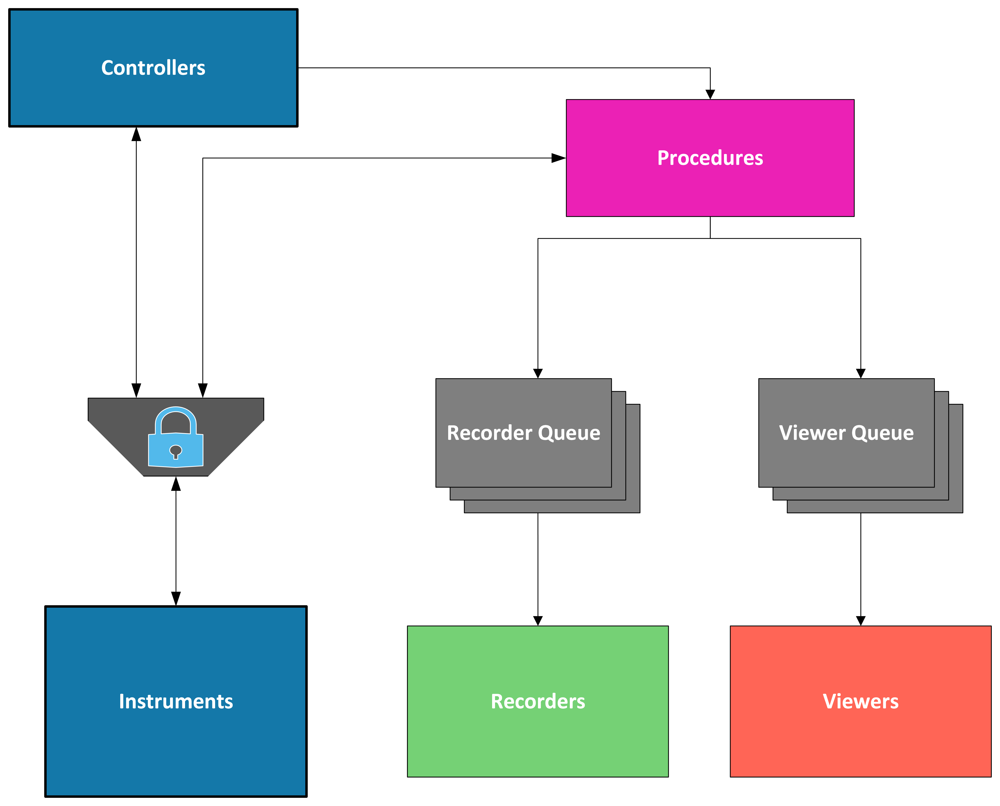

Fundamentals
=============

SPHERExLabTools consists of a set of :ref:`instrument-drivers` for low-level communication with instruments, :ref:`procedures` to specify the flow and execution of a measurement, :ref:`controllers` which provide graphical interfaces for command and control of instruments and procedures, :ref:`viewers` to display live data generated during procedure execution, and :ref:`recorders` to save data to files for later analysis. Each of these components are tied together by the top level :ref:`experiment_class`. The way in which each of these components interact can be understood through the simple data flow diagram shown below.

Each color in the diagram corresponds to a separate thread of execution. The graphical interfaces created by :ref:`controllers` and the code run by :ref:`instrument-drivers` each execute from within the main thread. :ref:`procedures`, which control and retrieve data from instruments, have their own thread. Since both controllers and procedures interact with instrument drivers on separate threads, a locking mechanism is implemented to prevent race conditions where multiple threads try to access the same instrument driver at the same time. Finally, :ref:`recorders` and :ref:`viewers` run in threads that pend on data to be placed on independent :python:`Queues </library/queue.html>` by active :ref:`procedures`. Once data is placed on a queue, the viewer or recorder thread becomes active in order to process the data to update a live display or save for later analysis. Each of these components can be configured independently in the manner described in :doc:`custom_experiments`. This configurability combined with the multi-threaded architecture provide a streamlined and flexible workflow for the setup of complex data-acquisition schemes. 

.. _`instrument-drivers`:

Instrument Drivers
------------------

SPHERExLabTools builds off of the existing repository of instrument drivers found within the :pymeasure:`PyMeasure Project <>`. Existing drivers within PyMeasure are integrated seamlessly. Drivers that have been developed specifically for SPHERExLabTools all inherit from the :pymeasure:`PyMeasure Instrument Base Class <api/instruments/instruments.html>`. Users may also develop their own drivers for instruments that are not already supported in SPHERExLabTools or PyMeasure. To do this, one should reference the *Instrument file* section of the :pymeasure:`PyMeasure adding instruments doc <dev/adding_instruments.html>`. One should also reference the existing :pymeasure:`PyMeasure Instrument Drivers <api/instruments>` and :doc:`SPHERExLabTools Instrument Drivers </api/instruments/index>` for examples on writing new drivers that are compatible with the package. 

.. _procedures:

Procedures
----------

At its core, a :ref:`SPHERExLabTools Procedure object <api/procedures/procedures:Base Procedure>` is no different from the :pymeasure:`PyMeasure Procedure object <api/experiment/procedure.html>` and many of the methods and attributes defined in the former are copied directly from the latter. The two differ in a few key technical implementation details that are not important for the purposes of this document. The curious reader can refer to the detailed api documentation for the SPHERExLabTools Procedure object linked above for more information. Quoting from the PyMeasure documentation:

        "The Procedure object bundles the sequence of steps in an experiment with the parameters required for its successful execution. This simple structure comes with huge benefits, since a number of convenient tools for making the measurement use this common interface."       

Let's take a look at a simple example procedure, *CamViewProc* which is defined in the alskdjfdas;jklasfd;jk

.. _controllers:

Controllers
-----------

.. _viewers:

Viewers
-------

.. _recorders:

Recorders
---------

.. _`experiment_class`:

Experiment Class
----------------

