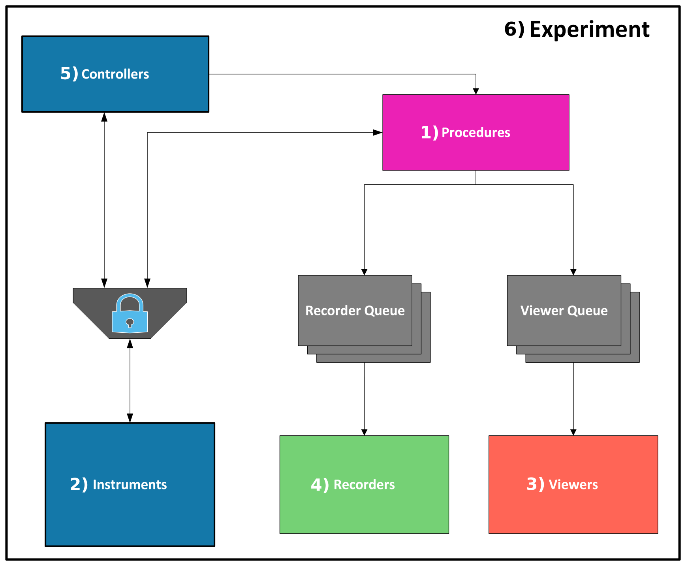

Fundamentals
#############

| SPHERExLabTools (SLT) provides a general purpose laboratory data acquisition and instrument control system with driver
  level software for control of testbed instrumentation, graphical interfaces, real-time data visualization, processing,
  data archival tools for a variety of output file formats, and mechanisms to run manual and automated measurements.
  Each component is highly configurable with minimal manual coding required by a user.

| SLT draws inspiration from the existing `PyMeasure <https://pymeasure.readthedocs.io/en/latest/>`_ and `PyHk <http://docs.pyhk.net/en/beta/>`_ projects.
  Many low-level architecture details are drawn directly from PyMeasure and the configuration file based interface was drawn from PyHk.

| This section outlines the basic architecture of SLT and provides brief descriptions of each component. For further architecture details and examples
  of how SLT has been used in early SPHEREx intrument characterization, see `Condon et. al. (2022) <https://arxiv.org/abs/2208.05099>`_

Architecture
------------

    **SLT Architecture**

| SLT implements 6 main classes which interact in the following manner. **1) Procedures**
  contain scripts which define the logical flow of a measurement; they interact directly with **2) Instruments**
  and generate data which they send to **3) Viewers** for real time graphical display and/or **4) Recorders** which
  archive data. Recorders and Viewers sit idle until data is placed on their associated queue, upon which they perform
  the appropriate archival or display task. **5) Controllers** provide graphical interfaces to interact directly with Instruments
  or to start/stop Procedure execution. Since both Controllers and Procedures have the ability to interact
  directly with Instruments, a locking mechanism is placed on Instruments such that only one controller/procedure
  thread of execution can access any given instrument driver class at a single instant. Finally, the **6) Experiment**
  class provides a top-level wrapper to interpret user configuration files and create instances of all of the previous
  classes. SLT is a multi-threaded application so many instances of each of these components can execute simultaneously.
  The color-scheme in this figure indicates the threading structure where each color corresponds to a separate thread of execution

Procedures
----------

| The central element of both PyMeasure and SLT is the Procedure class. Procedures are used to define the logical flow
  of a measurement, containing the scripts which interact directly with instruments, collect and process data, and
  send data to Viewers and Recorders. The basic working principle of a procedure in PyMeasure and SLT is the same,
  with SLT modifying the manner in which procedure output data is handled. Every procedure contains the following elements:

    1. **Parameter Objects:** Classes defining the configurable elements of a Procedure. These map directly to the graphical
       elements found in **Procedure Controllers** so that they can be set and modified via a graphical interface.

    2. **startup():** The initial method which executes first when a Procedure is started. In general, startup() is used
       to perform the initial configuration of instrumentation in a testbed before the real measurement begins.

    3. **execute():** This method always contains the main body of measurement control code and executes directly after
       startup(). This is where data is collected, processed, and sent out for display and archival.

    4. **shutdown():** The final method executing after execute(). Here, all instrumentation is placed in an idle state
       before the next measurement is run.

    5. **emit():** This is the method used to send data out to Viewers and Recorders for display and archival. All Viewers
       and Recorders have associated queue objects onto which data is placed through calls to emit(). When emit() is called
       from within a procedure, two arguments are provided: The first is a string that identifies which queue objects data
       should be sent to and the second is the data itself. When the Viewer and/or Recorder associated with a given queue
       object detects that new data is present, the data is retrieved from the queue and the appropriate display/archival
       task is performed.

Instruments
-----------

| SLT adopts the same instrument driver framework as PyMeasure allowing seamless integration of the extensive repository
  of existing PyMeasure drivers into SLT. Additionally, users of SLT can develop drivers for instruments not already
  supported by SLT or PyMeasure by following the detailed instructions found in the *Adding Instruments* section of the
  `PyMeasure documentation <https://pymeasure.readthedocs.io/en/latest/>`_.

| An additional feature implemented in SLT are :ref:`Compound Instruments <user_guide/compound_instruments:Compound Instruments>`.
  In a nutshell, Compound Instruments are used to combine multiple instrument driver instances into a single object allowing
  parameters of several instruments to be controlled under the same namespace. One example of a use-case is in the control
  of a gimbal mount that requires two motor controller driver instances; one to control the gimbal azimuth and and another
  for the zenith. Rather than having to implement a new **Gimbal** class manually, Compound Instruments allow one to automatically instantiate
  the two motor controller instances under the same object and interact with the new object as if it were a single instrument.

Viewers and Recorders
---------------------

| Viewers and Recorders are the objects that receive data sent out from the **emit()** call of a procedure. All viewers and
  recorders sit idle until data is placed on their associated queue with emit(), upon which they retrieve the data object
  and perform their archival or display task.

| To date, viewer classes have been developed to display multi-channel timestream and 2-dimensional image data.

| Recorder classes have been developed to suppport data output to CSV, HDF5, and MAT, as well as SQL databases.

Controllers
------------

| SLT implements two main types of controllers: **Instrument Controllers** and **Procedure Controllers**. Instrument Controllers
  couple directly to instrument drivers and allow manual control of any instrument supported by SLT and PyMeasure through
  graphical interfaces. Procedure Controllers are used to execute individual procedures as well as several procedures in a sequence.
  Users can set and modify the Parameter Objects for a given procedure and create nested for loops where the parameters of the procedure
  are modified at each step of the loop.